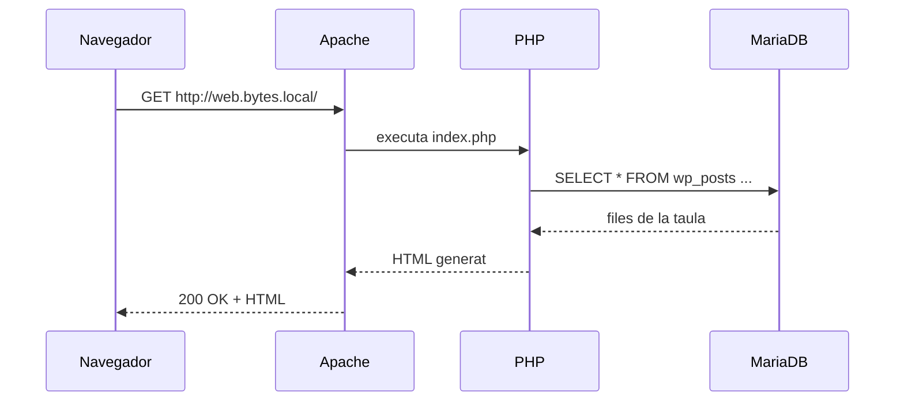

# Bloc 0 · L'entorn: un servidor LAMP

**2 sessions · 6 hores · Requeriments del RA1**

Totes les aplicacions del curs (WordPress, Moodle, Nextcloud, Roundcube) són aplicacions **PHP** que guarden les dades en una base de dades **MySQL/MariaDB** i se serveixen amb **Apache**. Abans d'instal·lar-ne cap, cal tenir aquesta base muntada i entesa.

## Què és una aplicació web

Una aplicació d'escriptori s'executa al teu ordinador. Una aplicació web s'executa en un **servidor**, i tu només hi accedeixes amb el navegador.



Tres conseqüències pràctiques per a l'administrador:

- **Instal·lar** és posar el codi en un directori que Apache serveixi, crear-li una base de dades i un usuari, i completar l'instal·lador web.
- **Actualitzar** és substituir el codi i deixar que l'aplicació adapti la base de dades. Abans, sempre, una còpia.
- **Fer una còpia** vol dir copiar **tres coses**: el codi, els fitxers pujats pels usuaris i la base de dades. Si en falta una, la còpia no serveix.

## La pila LAMP

| Lletra | Peça | Paper |
|---|---|---|
| L | Linux (Ubuntu Server) | Sistema operatiu |
| A | Apache | Servidor web: rep les peticions HTTP |
| M | MariaDB (o MySQL) | Base de dades |
| P | PHP | Executa el codi de l'aplicació |

A Windows existeix un paquet equivalent, **XAMPP**, que porta Apache, MariaDB i PHP en un sol instal·lador. Va bé per provar ràpid, però no s'utilitza en producció. El currículum demana instal·lar tant en sistemes lliures com propietaris, per això el veurem en aquest bloc.

## Pràctica 0.1 · El servidor de Bytes del Clot

**Objectiu:** tenir una màquina virtual amb LAMP funcionant i accessible des del navegador de l'amfitrió amb el nom `servidor.bytes.local`.

### 1. La màquina virtual

A VirtualBox, crea una màquina nova:

- Nom: `bytes-servidor`. Tipus Linux, Ubuntu 64 bits.
- 2 CPU, **4096 MB** de RAM, disc de 30 GB dinàmic.
- Xarxa: **adaptador pont** (o xarxa NAT amb redirecció de ports si l'aula no ho permet).

Instal·la Ubuntu Server 24.04 LTS amb aquestes opcions: usuari `admin`, nom de màquina `bytes-servidor`, **OpenSSH server** marcat. No marquis cap *snap* addicional.

Quan arrenqui, mira quina IP té i connecta-t'hi per SSH des de l'amfitrió, que és més còmode que la consola de VirtualBox:

```bash
ip -br a
ssh admin@192.168.1.50      # posa-hi la teva IP
```

> Fes una **instantània** de VirtualBox ara mateix i anomena-la `00-sistema-net`. Si després trenques alguna cosa, hi podràs tornar.

### 2. Apache, MariaDB i PHP

```bash
sudo apt update && sudo apt upgrade -y
sudo apt install -y apache2 mariadb-server php libapache2-mod-php php-mysql \
  php-curl php-gd php-intl php-mbstring php-xml php-zip php-soap php-bcmath unzip
```

Comprova cada peça:

```bash
systemctl status apache2 mariadb --no-pager
php -v
```

Obre `http://IP-DEL-SERVIDOR` al navegador de l'amfitrió: ha de sortir la pàgina *Apache2 Ubuntu Default Page*.

Protegeix MariaDB (contrasenya de root, eliminar usuaris anònims i la base de dades de prova):

```bash
sudo mariadb-secure-installation
```

### 3. Comprovar que PHP funciona

```bash
echo '<?php phpinfo();' | sudo tee /var/www/html/info.php
```

Obre `http://IP-DEL-SERVIDOR/info.php`. Busca-hi la versió de PHP i les extensions `mysqli` i `mbstring`. **Després esborra el fitxer**: ensenya massa informació del servidor a qualsevol visitant.

```bash
sudo rm /var/www/html/info.php
```

### 4. Noms de domini locals

No tenim DNS per a `bytes.local`, així que farem que l'amfitrió resolgui els noms amb el fitxer *hosts*.

- Windows: `C:\Windows\System32\drivers\etc\hosts`, editat amb el Bloc de notes **com a administrador**.
- Linux/macOS: `/etc/hosts`.

Afegeix-hi una línia amb tots els noms del curs:

```text
192.168.1.50  servidor.bytes.local web.bytes.local campus.bytes.local nuvol.bytes.local correu.bytes.local
```

Comprova-ho amb `ping web.bytes.local`.

### 5. El primer host virtual

Apache pot servir diversos webs des de la mateixa IP: mira la capçalera `Host` de la petició i tria el directori. Això és un **host virtual**, i en farem un per a cada aplicació.

```bash
sudo mkdir -p /var/www/servidor
echo '<h1>Servidor de Bytes del Clot</h1>' | sudo tee /var/www/servidor/index.html
sudo nano /etc/apache2/sites-available/servidor.conf
```

```apache
<VirtualHost *:80>
    ServerName servidor.bytes.local
    DocumentRoot /var/www/servidor
    ErrorLog ${APACHE_LOG_DIR}/servidor-error.log
    CustomLog ${APACHE_LOG_DIR}/servidor-access.log combined
</VirtualHost>
```

```bash
sudo a2ensite servidor.conf
sudo apache2ctl configtest      # ha de dir "Syntax OK"
sudo systemctl reload apache2
```

Obre `http://servidor.bytes.local`.

### 6. XAMPP a Windows

A l'equip Windows (o a una segona màquina virtual Windows), descarrega XAMPP des d'[apachefriends.org](https://www.apachefriends.org), instal·la'l a `C:\xampp` i arrenca Apache i MySQL des del panell de control. Obre `http://localhost/phpmyadmin`.

Respon al quadern: quines diferències veus respecte a la instal·lació a Linux? Per què XAMPP no es fa servir en un servidor de veritat?

### Lliurament de la P0.1

Al Moodle de l'institut, un PDF amb:

1. Captura de `systemctl status apache2 mariadb`.
2. Captura de `http://servidor.bytes.local` al navegador de l'amfitrió, amb la barra d'adreces visible.
3. Captura de XAMPP funcionant a Windows.
4. La teva **taula de requeriments**: per a cada aplicació del curs (WordPress, Moodle, Nextcloud, Roundcube), la versió mínima de PHP i de MariaDB que demana segons la seva documentació oficial, en anglès, amb l'enllaç d'on ho has tret.

## Per saber-ne més

- [Ubuntu Server: install Apache](https://documentation.ubuntu.com/server/how-to/web-services/install-apache2/)
- [Apache: Virtual Host examples](https://httpd.apache.org/docs/2.4/vhosts/examples.html)
