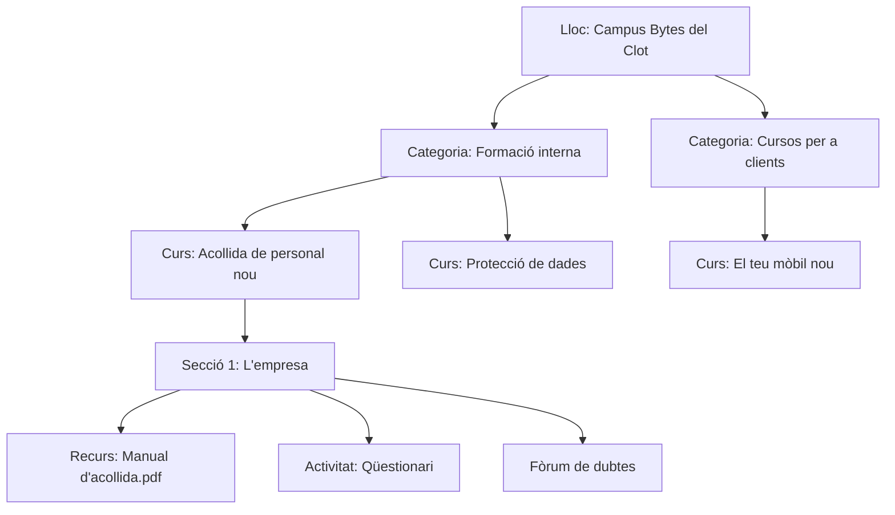

# Bloc 2 · Sistemes de gestió d'aprenentatge: Moodle

**5 sessions · 15 hores · RA2**

## Què és un LMS

Un **sistema de gestió de l'aprenentatge** (LMS, *Learning Management System*) és una aplicació web per fer formació a distància. Té tres tipus d'elements lògics:

- **Materials:** fitxers, pàgines, vídeos, enllaços.
- **Activitats:** tasques, qüestionaris, glossaris, wikis. Generen qualificacions.
- **Comunicació:** fòrums, missatgeria, consultes, avisos.

| LMS | Tipus | On es fa servir |
|---|---|---|
| **Moodle** | Lliure, PHP | Instituts i universitats. El Moodle de l'institut n'és un |
| Google Classroom | Al núvol, tancat | Escoles amb Google Workspace |
| Canvas | Lliure / al núvol | Universitats, sobretot als Estats Units |
| Chamilo | Lliure, PHP | Formació d'empreses |

A Bytes del Clot el campus servirà per formar els treballadors nous i per oferir cursos als clients (*Aprèn a fer servir el teu mòbil nou*).

## Pràctica 2.1 · Instal·lar Moodle

Consulta els requeriments de la versió actual a les [Release notes de Moodle](https://moodledev.io/general/releases). Moodle és més exigent que WordPress: versió de PHP recent, extensions addicionals i una configuració de PHP concreta.

### 1. Requeriments de PHP

```bash
sudo apt install -y php-xmlrpc php-soap php-intl php-zip php-gd php-curl php-mbstring
```

Moodle necessita que `max_input_vars` sigui com a mínim 5000:

```bash
php -v                                   # quina versió tens? p. ex. 8.3
sudo nano /etc/php/8.3/apache2/php.ini   # ajusta la versió
```

```ini
max_input_vars = 5000
upload_max_filesize = 100M
post_max_size = 100M
```

### 2. Base de dades

```sql
CREATE DATABASE moodle CHARACTER SET utf8mb4 COLLATE utf8mb4_unicode_ci;
CREATE USER 'moodle_user'@'localhost' IDENTIFIED BY 'Una-altra-contrasenya-llarga';
GRANT ALL PRIVILEGES ON moodle.* TO 'moodle_user'@'localhost';
FLUSH PRIVILEGES;
```

### 3. El codi i el directori de dades

Moodle separa **el codi** de **les dades** (els fitxers que pugen professors i alumnes). El directori de dades, `moodledata`, ha d'estar **fora** del directori que serveix Apache, perquè ningú no hi pugui accedir directament amb una URL.

```bash
cd /tmp
# A https://download.moodle.org copia l'enllaç del .tgz de l'última versió estable
wget -O moodle.tgz "ENLLAÇ-COPIAT"
tar xzf moodle.tgz
sudo mv moodle /var/www/campus
sudo mkdir /var/moodledata
sudo chown -R www-data:www-data /var/www/campus /var/moodledata
sudo chmod 770 /var/moodledata
```

### 4. Host virtual

Des de **Moodle 5.1**, el `DocumentRoot` ha d'apuntar a la subcarpeta `public` del codi. En versions anteriors apunta a l'arrel. Comprova quina versió has baixat.

```apache
# /etc/apache2/sites-available/campus.conf
<VirtualHost *:80>
    ServerName campus.bytes.local
    DocumentRoot /var/www/campus          # o /var/www/campus/public a partir de la 5.1
    <Directory /var/www/campus>
        AllowOverride None
        Require all granted
    </Directory>
    ErrorLog ${APACHE_LOG_DIR}/campus-error.log
    CustomLog ${APACHE_LOG_DIR}/campus-access.log combined
</VirtualHost>
```

```bash
sudo a2ensite campus.conf && sudo systemctl reload apache2
```

### 5. Instal·lador i cron

Obre `http://campus.bytes.local`, tria l'idioma català, indica `/var/moodledata` com a directori de dades i la base de dades del pas 2. L'instal·lador comprova tots els requeriments i t'avisa del que falti.

Moodle necessita una tasca programada que s'executi cada minut (enviar correus, netejar, calcular informes):

```bash
sudo crontab -u www-data -e
```

```text
* * * * * /usr/bin/php /var/www/campus/admin/cli/cron.php > /dev/null
```

### 6. Estructura del lloc i jerarquia de directoris

Aquest és el primer criteri del RA2. Documenta al quadern:

| On | Què hi ha |
|---|---|
| `/var/www/campus/config.php` | Configuració: `wwwroot`, `dataroot`, connexió a la base de dades |
| `/var/www/campus/mod/` | Mòduls d'activitat: `forum`, `assign`, `quiz`… |
| `/var/www/campus/theme/` | Temes |
| `/var/moodledata/filedir/` | Els fitxers pujats, guardats amb el nom canviat pel seu *hash* |
| `/var/moodledata/cache/`, `temp/` | Memòria cau i temporals |
| Base de dades `moodle` | Unes 500 taules amb prefix `mdl_` |

I l'estructura **lògica** del lloc: lloc › categories › cursos › seccions › recursos i activitats.



## Administració i aspecte

- **Aspecte:** *Administració del lloc › Aparença*. Tria el tema (Boost, Classic), puja el logotip, posa el color de marca i una pàgina principal amb la presentació del campus.
- **Categories i cursos:** crea l'estructura del diagrama anterior.

## Usuaris, rols i perfils

| Rol | Context habitual | Pot fer |
|---|---|---|
| Gestor | Lloc o categoria | Crear cursos, inscriure, veure informes |
| Creador de cursos | Lloc | Crear cursos nous |
| Professor | Curs | Editar el curs i qualificar |
| Professor sense permís d'edició | Curs | Qualificar, però no editar |
| Estudiant | Curs | Fer activitats |
| Convidat | Curs | Només mirar |

**Perfils personalitzats** (criteri 3 del RA2): Moodle permet afegir **camps de perfil** propis (*Administració del lloc › Usuaris › Camps del perfil d'usuari*) i **rols** nous a partir d'un d'existent.

### Pràctica 2.2 · Usuaris i perfils del campus

1. Crea dos camps de perfil: *Departament* (menú desplegable: Botiga, Servei tècnic, Oficina) i *Data d'incorporació*.
2. Crea un rol nou, **Tutor d'acollida**: copia el de *Professor sense permís d'edició* i treu-li el permís de veure les qualificacions dels altres.
3. Carrega els 12 treballadors amb un **fitxer CSV** (*Usuaris › Carrega usuaris*). Aquí en tens el format:

```text
username,firstname,lastname,email,password,profile_field_departament,cohort1
msoler,Marta,Soler,msoler@bytes.local,Canvia-la-1!,Oficina,personal
jpuig,Jordi,Puig,jpuig@bytes.local,Canvia-la-1!,Botiga,personal
```

4. Crea una **cohort** *Personal* i inscriu-la al curs *Acollida de personal nou*.

## Activitats i comunicació

### Pràctica 2.3 · El curs d'acollida

Munta el curs *Acollida de personal nou* amb:

- Un **fòrum** de dubtes, amb subscripció obligatòria.
- Una **consulta**: *Quin dia et va millor per a la formació presencial?*
- Una **tasca** amb lliurament de fitxer: *Puja el document de protecció de dades signat*.
- Un **qüestionari** de 5 preguntes sobre el manual d'acollida.

Comprova la comunicació: entra com a estudiant en una altra finestra del navegador (en mode d'incògnit), publica al fòrum, respon la consulta i mira que l'avís arriba al professor.

## Importar, exportar i còpies

| Què | Com | Format |
|---|---|---|
| Usuaris | Carrega usuaris / descarrega usuaris | CSV |
| Preguntes | Banc de preguntes › Importa/Exporta | GIFT, Moodle XML |
| Qualificacions | Qualificacions › Exporta | Excel, ODS, CSV |
| Un curs sencer | Còpia de seguretat del curs | `.mbz` |
| Contingut estàndard | Paquets d'activitats | SCORM, IMS |

### Pràctica 2.4 · Còpia i restauració

1. Importa 10 preguntes al banc en format **GIFT** (escriu-les tu amb un editor de text).
2. Fes la **còpia de seguretat** del curs d'acollida amb usuaris i descarrega el `.mbz`.
3. Esborra el curs i **restaura'l**. Comprova que hi tornen les activitats, els lliuraments i els missatges del fòrum.
4. Fes també la còpia **del lloc sencer** com faries a l'empresa: base de dades + codi + `moodledata`.

```bash
DATA=$(date +%F)
sudo -u www-data php /var/www/campus/admin/cli/maintenance.php --enable
sudo mariadb-dump moodle | sudo tee /backup/campus-$DATA.sql > /dev/null
sudo tar czf /backup/campus-$DATA.tar.gz /var/www/campus /var/moodledata
sudo -u www-data php /var/www/campus/admin/cli/maintenance.php --disable
```

Per què es posa el lloc en **mode manteniment** abans de copiar? Respon-ho al quadern.

## Informes i seguretat

- **Informes:** *Administració del lloc › Informes*: registres (*logs*), activitat del curs, participació, estadístiques. Treu un informe de qui ha entrat al curs d'acollida i quines activitats ha fet cadascú.
- **Seguretat:** *Administració del lloc › Informes › Visió general de seguretat*. Revisa'n cada punt i resol-los: política de contrasenyes, registre obert o no, perfils visibles per als convidats. Comprova també que `http://campus.bytes.local/../moodledata` **no** és accessible.

## Pràctica avaluable PA2 · El campus de Bytes del Clot

Campus funcionant a `campus.bytes.local` i informe en PDF amb una evidència per a cada criteri del RA2:

| Criteri | Evidència |
|---|---|
| Estructura i directoris | Taula de directoris comentada i diagrama de l'estructura lògica |
| Aspecte | Tema, logotip, colors i pàgina principal |
| Perfils | Camps de perfil i rol personalitzat, amb proves |
| Comunicació | Fòrum i consulta provats amb dos usuaris |
| Importar/exportar | CSV d'usuaris, preguntes GIFT, qualificacions exportades |
| Còpies | Curs restaurat i còpia del lloc sencer |
| Informes | Un informe d'accés i un de participació |
| Seguretat | Informe de visió general de seguretat sense errors crítics |

## Per saber-ne més

- [Moodle docs: Installing Moodle](https://docs.moodle.org/en/Installing_Moodle) · lectura en anglès del bloc
- [Moodle docs: GIFT format](https://docs.moodle.org/en/GIFT_format)
- [Moodle docs: Upload users](https://docs.moodle.org/en/Upload_users)
