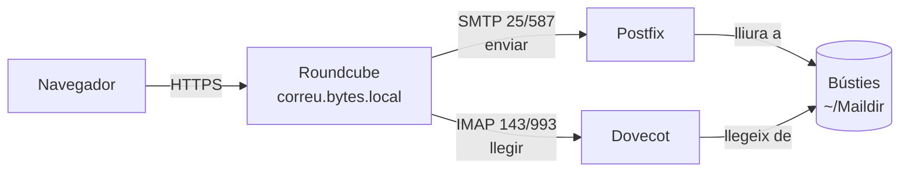

# Bloc 5 · Aplicacions web d'escriptori: correu i calendari

**3 sessions · 9 hores · RA5**

## Aplicacions web d'escriptori

Les **aplicacions web d'escriptori** són les eines del dia a dia de qualsevol oficina, portades al navegador: correu, calendari, contactes, tasques, notes. Gmail i Outlook.com en són els exemples que tothom coneix. En aquest bloc en muntem una versió pròpia.

| Aplicació | Tipus | Fa |
|---|---|---|
| **Roundcube** | Lliure, PHP | Correu web. El que porten molts proveïdors d'allotjament |
| SnappyMail | Lliure, PHP | Correu web lleuger |
| SOGo | Lliure | Correu, calendari i contactes en una sola eina |
| **Nextcloud Calendar / Contacts / Deck** | Lliure, PHP | Calendari i contactes (CalDAV/CardDAV), tasques en tauler |
| Gmail + Google Calendar, Outlook | Al núvol, tancats | Tot integrat |

## Com funciona el correu

El correu web **no és** un servidor de correu: és un client, com Thunderbird, però que s'executa al servidor.



- **Postfix**: el servidor SMTP, que envia i rep correus.
- **Dovecot**: el servidor IMAP, que deixa llegir les bústies.
- **Roundcube**: la interfície web que parla amb els dos.

El servidor de correu de veritat es treballa a *Serveis de xarxa*. Aquí en muntem el mínim per tenir correu entre usuaris de `bytes.local`.

## Pràctica 5.1 · Servidor de correu mínim

```bash
sudo apt install -y postfix dovecot-imapd
```

A l'assistent de Postfix: *Internet Site*, nom de correu `bytes.local`. Després:

```bash
sudo postconf -e 'home_mailbox = Maildir/'
sudo postconf -e 'mydestination = bytes.local, localhost'
sudo sed -i 's|^mail_location.*|mail_location = maildir:~/Maildir|' /etc/dovecot/conf.d/10-mail.conf
sudo systemctl restart postfix dovecot
```

Els comptes de correu seran **usuaris del sistema**:

```bash
sudo adduser jpuig
sudo adduser aruiz
```

Prova'l des de la terminal abans de posar-hi la interfície web:

```bash
sudo apt install -y mailutils
echo "Prova" | mail -s "Hola" jpuig@bytes.local
sudo ls /home/jpuig/Maildir/new
```

## Pràctica 5.2 · Roundcube

```bash
sudo apt install -y php-intl php-ldap php-imagick
```

Base de dades `roundcube` i usuari `rc_user`, com sempre. Després:

```bash
cd /tmp
# Enllaç del "Complete" de l'última versió a https://roundcube.net/download/
wget -O roundcube.tar.gz "ENLLAÇ-COPIAT"
tar xzf roundcube.tar.gz
sudo mv roundcubemail-* /var/www/correu
sudo chown -R www-data:www-data /var/www/correu
sudo mariadb roundcube < /var/www/correu/SQL/mysql.initial.sql
```

Host virtual `correu.bytes.local` apuntant a `/var/www/correu`, i obre `http://correu.bytes.local/installer/`. L'instal·lador:

1. Comprova els requeriments.
2. Genera `config/config.inc.php`. Paràmetres clau:

```php
$config['imap_host'] = 'localhost:143';
$config['smtp_host'] = 'localhost:25';
$config['mail_domain'] = 'bytes.local';
$config['product_name'] = 'Correu de Bytes del Clot';
```

3. Prova l'IMAP i l'SMTP des de la mateixa pàgina.

Quan funcioni, **esborra el directori `installer`**. Deixar-lo és un forat de seguretat conegut:

```bash
sudo rm -rf /var/www/correu/installer
```

### Verificar l'accés

Entra com a `jpuig`, envia un correu a `aruiz@bytes.local`, entra com a `aruiz` i respon. Configura una **signatura**, un **filtre** (el correu amb *Factura* a l'assumpte va a una carpeta) i una **resposta automàtica** de vacances (plugin *managesieve*, si el tens).

## Calendari web

Per al calendari fem servir el Nextcloud del Bloc 3, que ja té usuaris i grups.

### Pràctica 5.3 · L'agenda de Bytes del Clot

1. Instal·la les apps **Calendar**, **Contacts** i **Deck**.
2. Crea un calendari compartit *Servei tècnic* amb el grup, i un calendari públic *Horari de la botiga* amb enllaç per incrustar-lo a la web de WordPress.
3. Crea una **cita** amb convidats (una reparació a domicili), una **cita recurrent** (reunió de cada dilluns) i **tasques** amb data límit.
4. Crea un tauler **Deck** per a les reparacions: *Rebut › En diagnosi › Esperant peça › Llest*.
5. **Sincronitza el calendari amb el mòbil** per CalDAV (a Android amb DAVx⁵, a iPhone des de *Configuració › Calendari › Comptes*). Crea una cita al mòbil i comprova que surt al web.

### Per anar més enllà: integrar-ho tot

Connecta Roundcube amb els contactes de Nextcloud (plugin *carddav* de Roundcube), o fes que Nextcloud mostri el correu amb l'app *Mail*. Ara la intranet és una sola eina.

## Pràctica avaluable PA5

Informe amb:

| Criteri | Evidència |
|---|---|
| Aplicacions web d'escriptori | Comparativa de 4 aplicacions |
| Accés web al correu | Roundcube instal·lat, directori `installer` esborrat |
| Integració amb el servidor de correu | Configuració IMAP/SMTP explicada |
| Comptes d'usuari | Comptes creats, signatura, filtre |
| Verificació de l'accés | Correu enviat i rebut entre dos usuaris |
| Calendari web | Calendaris compartits, públic incrustat al WordPress |
| Prestacions | Cites, recurrents, tasques, Deck, sincronització amb el mòbil |

## Per saber-ne més

- [Roundcube: Installation](https://github.com/roundcube/roundcubemail/wiki/Installation) · lectura en anglès del bloc
- [Nextcloud: Groupware](https://docs.nextcloud.com/server/latest/admin_manual/groupware/index.html)
