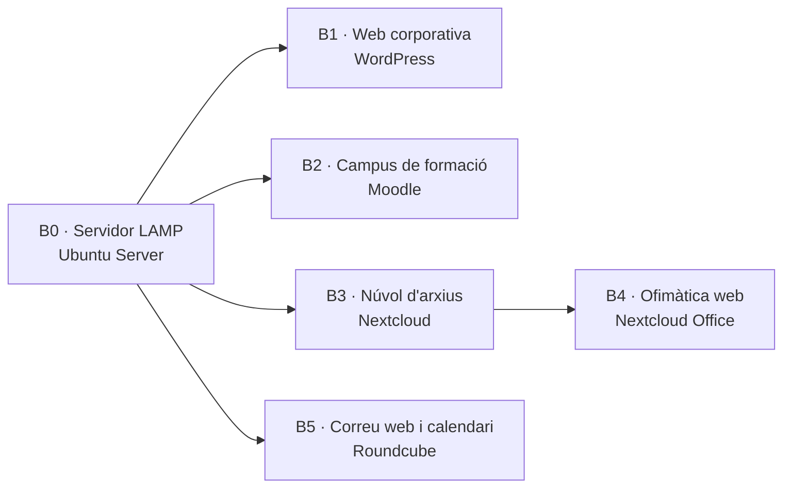

# Aplicacions web

**Mòdul 0228 · CFGM Sistemes Microinformàtics i Xarxes · 2n curs · Institut TIC de Barcelona · Curs 2026-27**

En aquest mòdul no es programa: s'**instal·len, es configuren i es mantenen** aplicacions web que ja existeixen. És la feina del tècnic que posa en marxa el web d'una empresa, el campus virtual d'una acadèmia o el núvol on l'oficina desa els documents, i que després els manté vius, segurs i amb còpia.

## El projecte del curs: la intranet de Bytes del Clot

Durant tot el mòdul muntareu, en un únic servidor Linux, la intranet d'una empresa fictícia: **Bytes del Clot SL**, una botiga i servei tècnic d'informàtica amb 12 treballadors. Cada bloc hi afegeix un servei:

| Bloc | Servei | Adreça a la intranet | RA |
|---|---|---|---|
| [B0 · L'entorn](/bloc-0) | Servidor LAMP | `servidor.bytes.local` | Requeriments del RA1 |
| [B1 · WordPress](/bloc-1) | Web corporativa amb fòrum | `web.bytes.local` | RA1 |
| [B2 · Moodle](/bloc-2) | Campus de formació interna | `campus.bytes.local` | RA2 |
| [B3 · Nextcloud](/bloc-3) | Arxius compartits | `nuvol.bytes.local` | RA3 |
| [B4 · Ofimàtica web](/bloc-4) | Documents col·laboratius | dins de `nuvol.bytes.local` | RA4 |
| [B5 · Correu i calendari](/bloc-5) | Correu web i agenda | `correu.bytes.local` | RA5 |

Al final del curs la intranet ha de funcionar sencera i l'heu de defensar: vegeu [Projecte: la intranet](/projecte).

## Com funciona el mòdul

- **66 hores al centre** i **53 hores d'estada a l'empresa**. Les sessions són pràctiques: cada sessió comença amb una explicació curta i la resta del temps és al vostre servidor.
- Cada bloc té **pràctiques guiades** (es fan a classe pas a pas) i una **pràctica avaluable** (la feu vosaltres i en lliureu les evidències).
- **Cada RA s'aprova per separat.** Aprovar WordPress no compensa suspendre Moodle. Ho trobareu explicat a [Programa i avaluació](/programa).
- El que heu après a *Sistemes operatius en xarxa* i *Serveis de xarxa* ho fareu servir constantment: terminal Linux, usuaris i permisos, Apache, DNS.

> **La regla d'or del mòdul:** si no ho pots tornar a muntar des de zero seguint les teves notes, no ho has après. Documenta cada pas al teu quadern de bitàcola mentre el fas, no després.

## Què necessites

- Un portàtil o l'equip de l'aula amb **VirtualBox** i 4 GB de RAM lliures per a la màquina virtual.
- La ISO d'**Ubuntu Server 24.04 LTS**.
- Un compte al Moodle de l'institut, on es lliuren les pràctiques.
- Ganes de trencar coses i tornar-les a arreglar. Per això hi ha les instantànies de VirtualBox.
